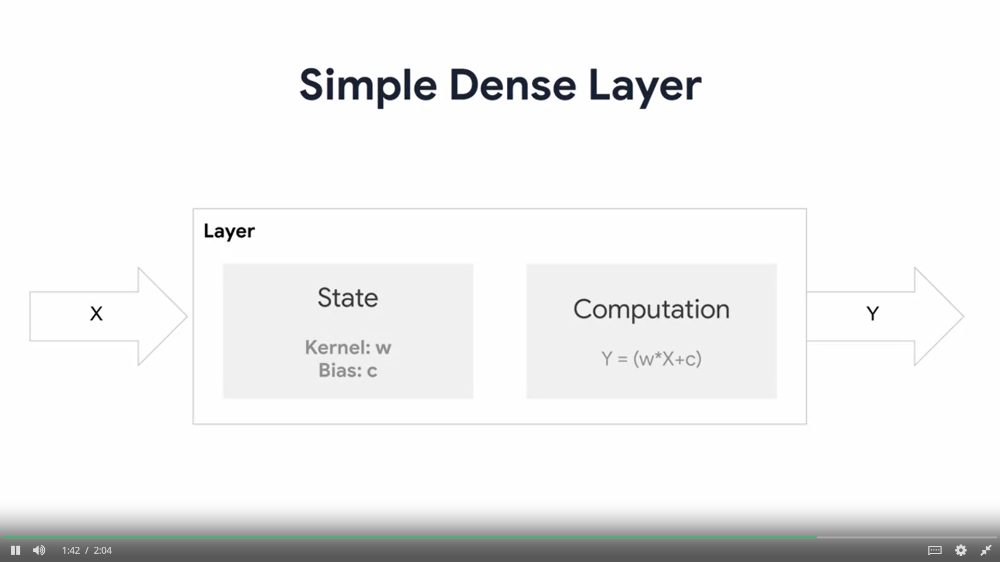

# This folder consists of code about how to implement Custom layers in tensorflow

### lambda_layer.py >> file consists implementation of lambda layer in tensorflow.

Lambda Layers are good for basic customising of layers.

